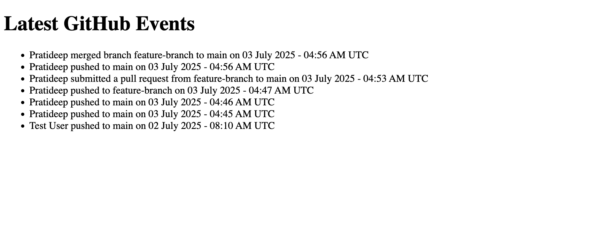

# 📡 Webhook Receiver — Developer Assessment Task

This is the **webhook-repo** for the developer assessment.  
It acts as the **GitHub webhook receiver** for the `action-repo`,  
saves incoming events to **MongoDB**, and displays them in a **minimal UI**.

---

## ✅ Requirements

- Python 3.8+
- pip
- MongoDB running (local or cloud)
- ngrok (for local testing)

---

## 📌 Features

- Receives **Push**, **Pull Request**, and **Merge** events.
- Stores events in MongoDB in this schema:
  ```json
  {
    "author": "Travis",
    "action": "push | pull_request | merge",
    "from_branch": "feature",
    "to_branch": "main",
    "timestamp": "ISODate"
  }


Below is an example of how the updates look in the browser:

